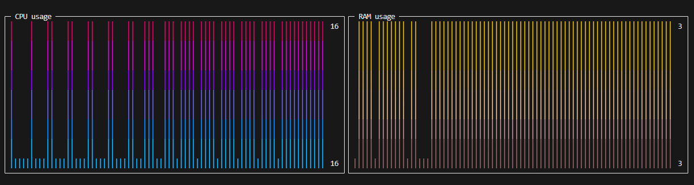

# [Sampler](https://github.com/sqshq/sampler)使用指南 --- SamplerUsageGuide

## Sparkline获得CPU usage和RAM usage
配置文件如下
```yml
sparklines:
  - title: CPU usage
    rate-ms: 200
    scale: 0
    sample: ps -A -o %cpu | awk '{s+=$1} END {print s}'
  - title: RAM usage
    rate-ms: 200
    scale: 0
    sample: free | awk '/Mem/{printf "%.2f", $3/$2 * 100}'

```
### 使用
- 安装sampler, 参考[Sampler](https://github.com/sqshq/sampler)
- 在更目录下执行命令`cd config && sampler -c cpuRamUsage.yml `

### 效果展示
